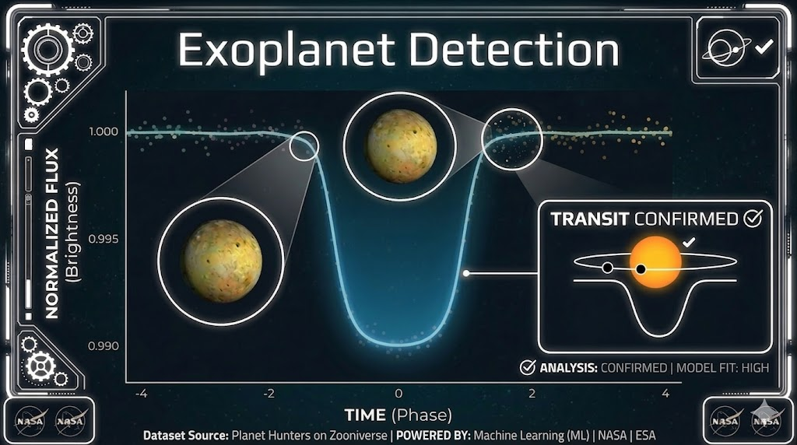

# [Exoplanet Detection](https://github.com/MonicaCheely/exoplanet-detection)

[](https://github.com/MonicaCheely/exoplanet-detection)

## Project Overview
This project uses **light curve data** to detect potential exoplanets through **machine learning** and statistical modeling. It demonstrates data preprocessing, feature extraction, and classification techniques applied to astronomical datasets.

### Key Features
- Preprocess and clean light curve data from telescopes
- Extract meaningful features for transit detection
- Apply machine learning models to classify potential exoplanets
- Visualize results and highlight candidate transits

### Skills & Tools
- Python, Pandas, NumPy  
- Matplotlib & Seaborn for visualization  
- Scikit-learn for machine learning  
- Jupyter notebooks for experimentation  
- Git/GitHub for version control

### Future Work
- Expand dataset with additional light curves  
- Improve model accuracy using ensemble and deep learning methods  
- Build an interactive dashboard to visualize detected exoplanets

### How to Run
1. Clone the repository:  
   ```bash
   git clone https://github.com/MonicaCheely/exoplanet-detection.git
